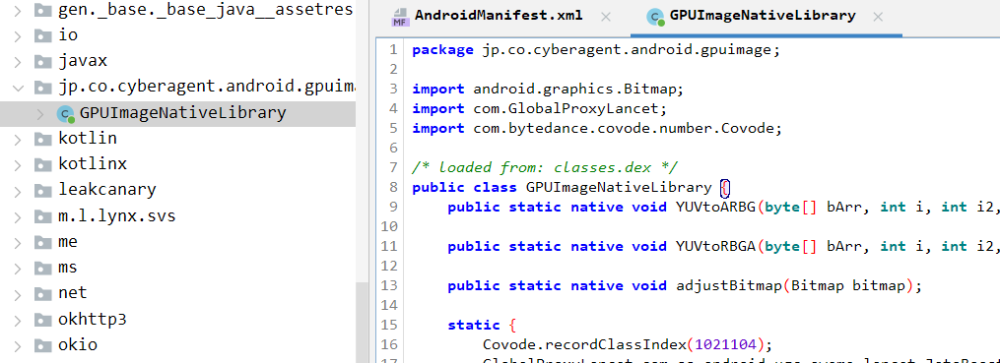
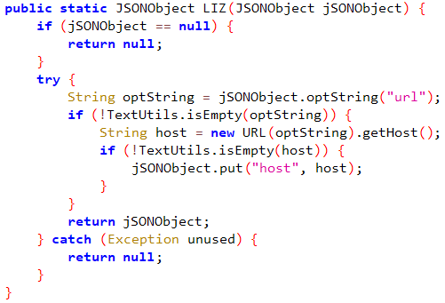

# Reverse engineering to obtain some-yin playback and download links

When we play some-yin, sometimes when we see a video we like, we usually want to download and save it. Some videos in some-yin can find the download button through sharing, but for some videos, the download button is gray and cannot be downloaded. Even if it can be downloaded, the downloaded video may be watermarked. So, how can you download some-yin videos freely and without watermarks? Here, I share a method to find some-yin playback and download video links through reverse engineering.
First, download the latest version of some-yin for Android. I am using the latest version 30.6.0 here. After downloading, decompile:


Because its apk is over 230MB, the amount of decompiled code is relatively large and analysis is time-consuming. You can narrow the scope through preliminary analysis, such as focusing on analyzing okhttp3 (http/https message interaction), ttvideoengine (playback engine) and other codes, and combining it with VirtualXposed's Hook to locate the key code locations.
In this way, I locate the DataLoaderCDN:


The LIZ method is a method with an obfuscated name and can be hooked directly:
```java
XposedHelpers.findAndHookMethod("com.ss.ttvideoengine.DataLoaderCDN", loadPackageParam.classLoader, "LIZ", JSONObject.class,new XC_MethodHook() {
            protected void afterHookedMethod(MethodHookParam param) throws Throwable {
                super.afterHookedMethod(param);
                if(param.args[0] != null) {
                    MainXposed.log(TAG + MODULE, "videourl: " + XposedHelpers.callMethod(param.args[0], "optString", "url"));
                }
            }
        });
```
We install the Hook plug-in to the mobile phone. When browsing some-yin, we can capture the link of the currently playing video in real time, similar to the following:：https://v13-traffic-b.douyinvod.com/0d361ccdc22323677e017acaca17b1ad/668f6a25/video/tos/cn/tos-cn-ve-15/owuA2EeIXAfuzZcQRRIusBAWF2ggL7H0GOHfff/?a=1128&ch=5&cr=3&dr=0&lr=all&cd=0%7C0%7C0%7C3&cv=1&br=327&bt=327&cs=2&ds=6&ft=JiBz7PxxouhL.D1PD12ldU6pt2Gs68KiSOc.RkaN2ot3vjVhWJ6&mime_type=video_mp4&qs=11&rc=NGk1Njs6aDhlaDw8NGQ4aUBpand1Om05cm15czMzNGkzM0AzYTIzYGFfNjExXzQ2MDEyYSNnLWFmMmQ0b3NgLS1kLS9zcw%3D%3D&btag=c0008e00098008&cdn_type=1&cquery=103W_103Y_100b_104g_103Q&dy_q=1720671217&feature_id=c6de0308cacfd993ef282c8e1c646267&l=202407111213364C5F771F1CF4CC8D9335&n80=1&n80_dm=bjk4LXYtbmNkbi5kb3V5aW52b2QuY29t&n80_tk=c375a3c028181a7973057df507181efb&pdp=online_xy&pwid=243&req_cdn_type=r

Copy the captured link to the browser to play or download high-definition videos without watermarks:


Disclaimer: The methods introduced in this article are for learning and entertainment only and are strictly prohibited for illegal purposes!
